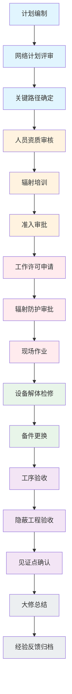

## 1. 产品概述
核电站换料大修Web系统是为核电站检修团队设计的专业管理平台，用于管控停堆大修全过程的工序安排、辐射防护和质量控制，确保大修安全、高效、高质量完成。
- 主要用途：大修计划编制、工序排程、人员资质管理、辐射剂量监控、设备检修跟踪、质量验收管理、经验反馈积累
- 目标用户：大修经理、计划工程师、辐射防护人员、检修工程师、质量控制人员
- 核心价值：提升大修管理效率，降低辐射风险，保障检修质量，积累大修经验

## 2. 核心功能

### 2.1 用户角色
| 角色 | 注册方式 | 核心权限 |
|------|----------|----------|
| 大修经理 | 系统分配 | 全局数据查看、进度管控、审批决策 |
| 计划工程师 | 系统分配 | 计划编制、工序排程、进度跟踪 |
| 辐射防护人员 | 系统分配 | 人员准入管理、剂量监控、辐射许可审批 |
| 检修工程师 | 系统分配 | 设备检修管理、备件更换、工序执行 |
| 质量控制人员 | 系统分配 | 质量验收、见证点确认、质量记录 |

### 2.2 功能模块
1. **大修计划**：大修网络计划编制、关键路径跟踪、进度看板
2. **工序排程**：工序分解、资源分配、进度跟踪、甘特图展示
3. **人员准入**：资质审核、培训记录、准入审批、人员排班
4. **辐射剂量**：辐射工作许可、个人剂量监控、剂量超限预警、区域剂量监测
5. **设备检修**：设备解体检修、备件更换、检修记录、缺陷跟踪
6. **质量验收**：隐蔽工程验收、质量见证点确认、验收记录、质量趋势分析
7. **经验反馈**：历史大修查询、经验库管理、案例分享、改进措施跟踪

### 2.3 页面详情
| 页面名称 | 模块名称 | 功能描述 |
|----------|----------|----------|
| 大修计划 | 网络计划 | PERT网络图展示、关键路径高亮、里程碑标记、计划调整 |
| 大修计划 | 关键路径 | 关键活动列表、预计工期、实际进度、延误预警 |
| 大修计划 | 进度看板 | 整体进度百分比、各专业进度、里程碑达成情况 |
| 工序排程 | 甘特图 | 时间轴展示、工序依赖关系、资源负载、进度对比 |
| 工序排程 | 工序管理 | 工序创建、分配、状态更新、问题记录 |
| 人员准入 | 资质管理 | 人员资质证书、培训记录、有效期管理、过期预警 |
| 人员准入 | 准入审批 | 申请单流转、资质校验、审批记录 |
| 辐射剂量 | 工作许可 | 辐射工作许可证申请、审批、发放、延期 |
| 辐射剂量 | 个人剂量 | 实时剂量查询、累计剂量统计、历史趋势 |
| 辐射剂量 | 超限预警 | 剂量阈值设置、超限告警、处理记录 |
| 设备检修 | 解体记录 | 解体前检查、解体步骤、零部件检查、测量数据 |
| 设备检修 | 备件更换 | 备件需求、领用记录、更换确认、旧件处理 |
| 质量验收 | 隐蔽工程 | 验收申请、现场验证、验收记录、影像资料 |
| 质量验收 | 见证点 | H/W/R点清单、见证计划、见证记录、放行确认 |
| 经验反馈 | 历史查询 | 大修档案检索、数据对比、报告导出 |
| 经验反馈 | 经验库 | 问题分类、根本原因、改进措施、效果验证 |

## 3. 核心流程
大修开始前，计划工程师编制大修网络计划并确定关键路径；检修人员需通过资质审核和辐射培训方可进入现场；辐射防护人员根据工作内容审批辐射工作许可并监控个人剂量；检修工程师按照工序执行设备解体检修和备件更换；质量控制人员在关键节点进行隐蔽工程验收和见证点确认；大修完成后所有数据归档至经验反馈库，供后续大修参考。

## 4. 用户界面设计

### 4.1 设计风格
- **主色调**：深蓝色 #0D47A1（专业、可靠、工业感），用于导航栏、主要按钮、标题强调
- **辅助色**：橙色 #E65100（辐射预警、高亮提醒），用于剂量预警、关键路径标记
- **成功色**：绿色 #2E7D32，用于验收通过、正常状态
- **警告色**：黄色 #F9A825，用于即将过期、警告状态
- **危险色**：红色 #C62828，用于剂量超限、验收不通过
- **中性色**：深灰 #37474F、中灰 #607D8B、浅灰 #ECEFF1，用于文字、背景、边框
- **按钮风格**：直角矩形，2px边框，悬停时背景色加深15%，点击时有下沉效果
- **字体**：标题使用 "Noto Sans SC" 700，正文使用 "Noto Sans SC" 400，数字使用 "JetBrains Mono" 等宽字体
- **布局风格**：左侧导航栏 + 顶部状态栏 + 主内容区三栏布局，卡片式内容模块，数据仪表盘网格布局
- **图标风格**：线性图标，24px标准尺寸，使用 lucide-react 图标库，颜色与文字一致

### 4.2 页面设计概述
| 页面名称 | 模块名称 | UI元素 |
|----------|----------|--------|
| 大修计划 | 进度看板 | 顶部统计卡片（总进度、关键节点、剩余天数），中部甘特图，底部关键路径列表 |
| 大修计划 | 网络计划 | 全屏SVG网络图，节点可拖拽，关键路径红色高亮，悬停显示详情 |
| 工序排程 | 甘特图 | 时间轴可缩放，工序条按专业着色，依赖关系连线，进度条填充 |
| 人员准入 | 资质管理 | 人员卡片列表，资质标签带有效期进度条，过期红色标记 |
| 辐射剂量 | 剂量监控 | 仪表盘式剂量显示，阈值线红色标记，超限闪烁动画 |
| 设备检修 | 检修记录 | 分步式时间轴，每步含状态标签、操作人、时间、附件 |
| 质量验收 | 验收流程 | 流程状态图，已完成步骤打钩，当前步骤高亮 |
| 经验反馈 | 经验库 | 分类标签页，问题卡片带严重程度标记，可展开查看详情 |

### 4.3 响应性
- 采用 Desktop-first 设计，主界面最小支持 1366px 宽度
- 核心图表区域使用固定宽度容器，支持横向滚动
- 侧边栏可折叠，折叠后图标显示
- 数据表格支持列宽调整、固定表头
- 移动端优化：菜单改为底部导航，图表简化为卡片列表

### 4.4 动画交互
- 页面加载：顶部进度条动画 + 内容区渐入
- 数据更新：数值变化时数字滚动动画
- 预警提示：红色边框脉冲动画 + 右下角Toast通知
- 状态切换：卡片翻转动画展示前后状态
- 悬停效果：按钮和卡片的微阴影过渡
