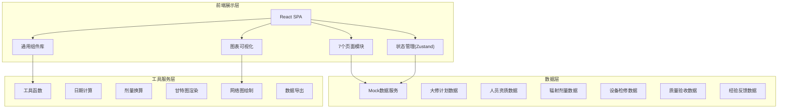
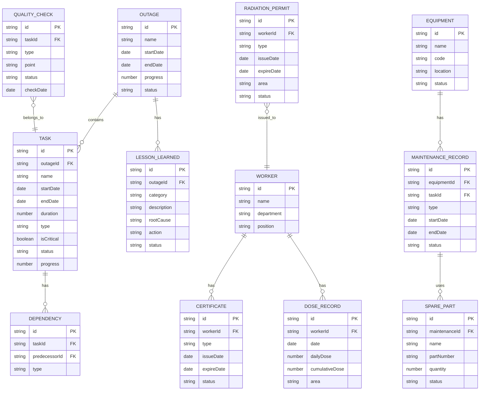

## 1. 架构设计



## 2. 技术描述
- **前端框架**：React@18 + TypeScript@5 + Vite@5
- **样式方案**：TailwindCSS@3 + CSS变量主题系统
- **状态管理**：Zustand@4，分模块管理业务状态
- **路由管理**：React Router DOM@6
- **图表库**：自实现SVG甘特图和网络图，避免复杂依赖
- **图标库**：Lucide React@0.344
- **数据方案**：前端Mock数据 + TypeScript类型定义，无后端
- **构建工具**：Vite@5，配置路径别名@指向src目录

## 3. 路由定义
| 路由路径 | 页面名称 | 用途 |
|----------|----------|------|
| / | 大修计划 | 进度看板、网络计划、关键路径跟踪 |
| /schedule | 工序排程 | 甘特图展示、工序管理、资源分配 |
| /access | 人员准入 | 资质管理、准入审批、人员排班 |
| /dosimetry | 辐射剂量 | 工作许可、个人剂量、超限预警 |
| /maintenance | 设备检修 | 解体检修、备件更换、检修记录 |
| /quality | 质量验收 | 隐蔽工程验收、见证点确认、质量记录 |
| /experience | 经验反馈 | 历史大修查询、经验库、案例分享 |

## 4. 数据模型

### 4.1 核心数据模型定义



### 4.2 TypeScript 类型定义

```typescript
// 大修计划
interface Outage {
  id: string;
  name: string;
  startDate: string;
  endDate: string;
  progress: number;
  status: 'planning' | 'in_progress' | 'completed';
  totalTasks: number;
  completedTasks: number;
  criticalPathTasks: Task[];
}

// 工序任务
interface Task {
  id: string;
  outageId: string;
  name: string;
  category: 'mechanical' | 'electrical' | 'instrument' | 'radiation' | 'other';
  startDate: string;
  endDate: string;
  duration: number;
  isCritical: boolean;
  status: 'pending' | 'in_progress' | 'completed' | 'delayed';
  progress: number;
  assignees: string[];
  dependencies: string[];
  description: string;
}

// 工作人员
interface Worker {
  id: string;
  name: string;
  department: string;
  position: string;
  avatar: string;
  certificates: Certificate[];
  currentDose: number;
  annualDoseLimit: number;
  status: 'available' | 'on_site' | 'training' | 'unavailable';
}

// 资质证书
interface Certificate {
  id: string;
  type: string;
  issueDate: string;
  expireDate: string;
  status: 'valid' | 'expiring' | 'expired';
}

// 剂量记录
interface DoseRecord {
  id: string;
  workerId: string;
  date: string;
  dailyDose: number;
  cumulativeDose: number;
  area: string;
  workType: string;
}

// 辐射工作许可
interface RadiationPermit {
  id: string;
  permitNumber: string;
  workerId: string;
  workerName: string;
  type: 'red' | 'orange' | 'yellow' | 'green';
  area: string;
  workContent: string;
  doseLimit: number;
  issueDate: string;
  expireDate: string;
  status: 'pending' | 'approved' | 'active' | 'expired' | 'revoked';
  approver: string;
}

// 设备
interface Equipment {
  id: string;
  name: string;
  code: string;
  system: string;
  location: string;
  status: 'normal' | 'maintenance' | 'defective';
  lastMaintenance: string;
  nextMaintenance: string;
}

// 检修记录
interface MaintenanceRecord {
  id: string;
  equipmentId: string;
  taskId: string;
  type: 'disassembly' | 'inspection' | 'repair' | 'replacement' | 'assembly';
  description: string;
  operator: string;
  startTime: string;
  endTime: string;
  status: 'pending' | 'in_progress' | 'completed' | 'failed';
  findings: string;
  measurements: { name: string; value: string; unit: string; standard: string }[];
  spareParts: SparePart[];
  photos: string[];
}

// 备件
interface SparePart {
  id: string;
  name: string;
  partNumber: string;
  quantity: number;
  usedQuantity: number;
  unit: string;
  status: 'reserved' | 'issued' | 'used' | 'returned';
}

// 质量验收
interface QualityCheck {
  id: string;
  taskId: string;
  type: 'hidden' | 'witness' | 'review';
  point: 'H' | 'W' | 'R';
  name: string;
  description: string;
  standard: string;
  inspector: string;
  checkDate: string;
  status: 'pending' | 'passed' | 'failed' | 'rework';
  result: string;
  attachments: string[];
}

// 经验反馈
interface LessonLearned {
  id: string;
  outageId: string;
  outageName: string;
  category: 'schedule' | 'safety' | 'quality' | 'cost' | 'radiation';
  severity: 'low' | 'medium' | 'high' | 'critical';
  title: string;
  description: string;
  rootCause: string;
  correctiveAction: string;
  preventiveAction: string;
  status: 'open' | 'in_progress' | 'closed' | 'verified';
  reportedBy: string;
  reportDate: string;
  closedDate: string;
}
```

## 5. 前端项目结构

```
src/
├── components/          # 通用组件
│   ├── Layout/         # 布局组件
│   ├── DataCard/       # 数据卡片
│   ├── GanttChart/     # 甘特图组件
│   ├── NetworkGraph/   # 网络图组件
│   ├── ProgressBar/    # 进度条
│   ├── StatusBadge/    # 状态标签
│   ├── DoseGauge/      # 剂量仪表盘
│   └── Timeline/       # 时间轴
├── pages/              # 页面组件
│   ├── OutagePlan/     # 大修计划
│   ├── Schedule/       # 工序排程
│   ├── AccessControl/  # 人员准入
│   ├── Dosimetry/      # 辐射剂量
│   ├── Maintenance/    # 设备检修
│   ├── Quality/        # 质量验收
│   └── Experience/     # 经验反馈
├── store/              # Zustand状态管理
│   ├── outageStore.ts
│   ├── workerStore.ts
│   ├── dosimetryStore.ts
│   ├── equipmentStore.ts
│   ├── qualityStore.ts
│   └── experienceStore.ts
├── data/               # Mock数据
│   ├── outage.ts
│   ├── workers.ts
│   ├── dosimetry.ts
│   ├── equipment.ts
│   ├── quality.ts
│   └── experience.ts
├── types/              # TypeScript类型定义
│   └── index.ts
├── utils/              # 工具函数
│   ├── date.ts
│   ├── dose.ts
│   ├── format.ts
│   └── chart.ts
├── App.tsx
├── main.tsx
├── index.css
└── router.tsx
```

## 6. 状态管理设计

```typescript
// 大修计划状态
interface OutageState {
  currentOutage: Outage | null;
  tasks: Task[];
  selectedTask: Task | null;
  loading: boolean;
  setCurrentOutage: (outage: Outage) => void;
  setTasks: (tasks: Task[]) => void;
  updateTask: (id: string, updates: Partial<Task>) => void;
  getCriticalPath: () => Task[];
  getProgress: () => number;
}

// 辐射剂量状态
interface DosimetryState {
  doseRecords: DoseRecord[];
  permits: RadiationPermit[];
  alerts: Alert[];
  addDoseRecord: (record: DoseRecord) => void;
  createPermit: (permit: Omit<RadiationPermit, 'id'>) => void;
  checkDoseAlerts: (workerId: string) => Alert[];
  getWorkerCumulativeDose: (workerId: string) => number;
}
```

## 7. 关键技术实现

### 7.1 甘特图实现
- 使用SVG自实现甘特图，无需第三方库
- 支持时间轴缩放（日/周/月视图）
- 工序条按专业分类着色
- 依赖关系连线绘制
- 进度条实时更新
- 支持拖拽调整工期

### 7.2 网络图实现
- PERT网络图SVG绘制
- 节点自动布局算法
- 关键路径高亮显示
- 节点悬停详情展示
- 支持节点拖拽调整

### 7.3 剂量监控仪表盘
- SVG实现仪表盘组件
- 阈值线标记
- 实时数值更新动画
- 超限警告闪烁效果
- 历史趋势折线图

### 7.4 主题系统
- CSS变量定义主题色
- 支持亮/暗模式切换
- 统一的间距、圆角、阴影系统
- 状态色与语义化绑定
